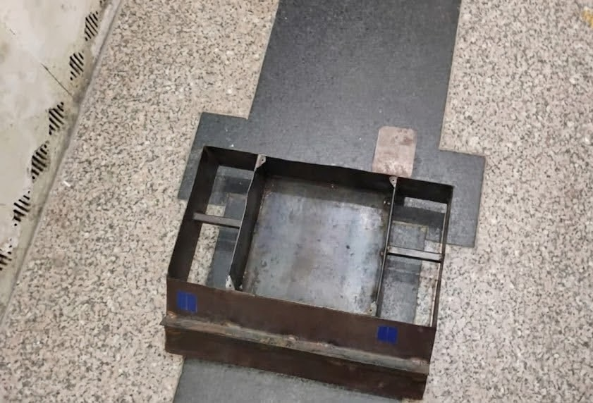
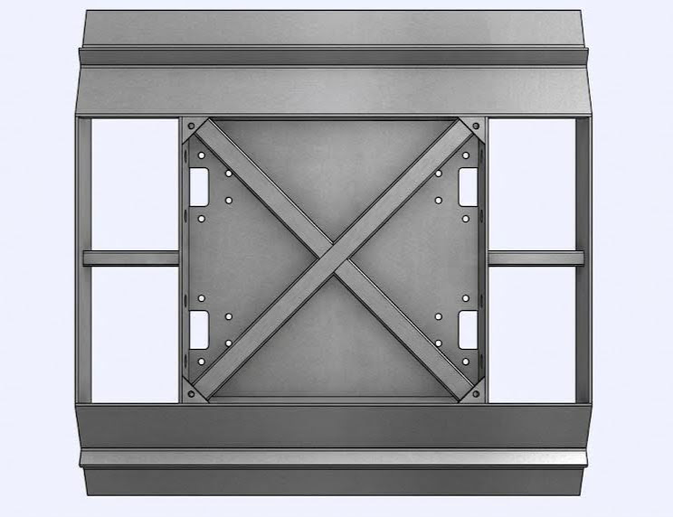
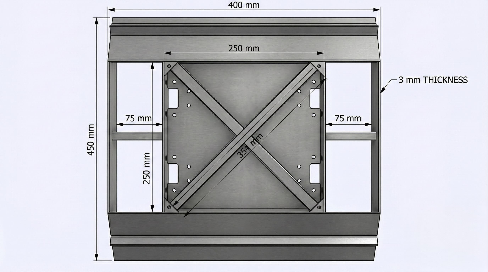

# ModularBOT Firmware – STM32 Nucleo-F303RE

A modular robotics control platform featuring autonomous RC calibration, differential motor mixing, and FlySky i-BUS receiver support.

## Quick Start

### Prerequisites
- PlatformIO IDE or CLI (`python -m pip install platformio`)
- STM32 ST-Link debugger
- Nucleo-F303RE development board

### Build
```bash
pio run
```

### Upload
```bash
pio run -t upload
```

### Monitor Serial Output
```bash
pio device monitor
```

## Hardware Setup

### Robot (STM32 Nucleo-F303RE)

| Component          | Connection                | Note                             |
|--------------------|--------------------------|---------------------------------|
| ESP32 Receiver     | PA9 (TX) / PA10 (RX)     | UART @ 115200 baud              |
| Motor 1 PWM        | PA8, PA11 + PC7 (EN)     | TIM1_CH1/CH4                    |
| Motor 2 PWM        | PA6, PA7 + PB6 (EN)      | TIM3_CH1/CH2                    |
| Motor 3 PWM        | PB0, PB1 + PA5 (EN)      | TIM3_CH3/CH4                    |
| Motor 4 PWM        | PB4, PB5 + PC6 (EN)      | TIM3_CH1/CH2                    |
| HuskyLens I2C      | PB8 (SCL) / PB9 (SDA)    | Reserved for future integration |

### Custom Radio Link (ESP-NOW)

**Remote (LILYGO T-Display ESP32)**

| Component          | GPIO  | Note                     |
|--------------------|-------|-------------------------|
| Left Joystick (Y)  | 32    | Throttle (ADC)          |
| Right Joystick (X) | 36    | Steering (VP, ADC)      |
| Button 1           | 17    | Active LOW, pullup      |
| Button 2           | 21    | Active LOW, pullup      |
| Button 3           | 22    | Active LOW, pullup      |
| Button 4           | 27    | Active LOW, pullup      |
| TFT Display        | Built-in (ST7789) | Shows telemetry       |
| USB-C Port         | Built-in | Rechargeable via USB-C  |
| Battery            | JST 1.25mm | 3.7V 1S LiPo with BMS   |


**Receiver (LILYGO T-Display ESP32 (yes same as the remote))**

| Component          | GPIO  | Note                     |
|--------------------|-------|-------------------------|
| UART TX → STM32    | 17    | Forwards control data   |
| UART RX ← STM32    | 16    | Optional feedback       |
| Battery Sensor     | 34    | ADC voltage divider     |

## Firmware Behavior

1. **Boot** (~500 ms): Initialize Serial @ 115200, UART receiver.
2. **Calibration** (10 seconds): Collects RC channel min/max while motors stay stopped. Move joysticks to extremes on remote, then center.
3. **Active** (post-calibration): 
   - Parse incoming UART packets from ESP32: `< Throttle_H Throttle_L Steering_H Steering_L >`
   - Map throttle + steering to motor PWM via calibrated ranges with deadzone.
   - Differential mixing: left motors = throttle + steering, right motors = throttle − steering.
   - Any communication timeout or invalid packet → all motors stop immediately.
   - Note - I plan to remove callibration after the final thing that ships...
4. **Telemetry**: ESP32 receiver reads battery voltage and transmits it back to the remote via ESP-NOW for display.

## Project Structure

```
├── include/
│   └── pins.h              # Pin & protocol configuration
├── src/
│   ├── main.cpp            # Control loop & initialization
│   ├── motor_driver.cpp/h  # BTS7960 H-bridge abstraction
│   ├── rc_input.cpp/h      # i-BUS polling & frame handling
│   ├── calibration.cpp/h   # RC min/max/neutral tracking
├── docs/
│   └── architecture.md     # Design & module details
├── platformio.ini          # Build & dependency config
└── README.md               # This file
```


## License

MIT

## Author

Arnav – ModularBOT Project

## Chassis Design

Here are the CAD designs for the main frame and a photo of the welded chassis so far.






